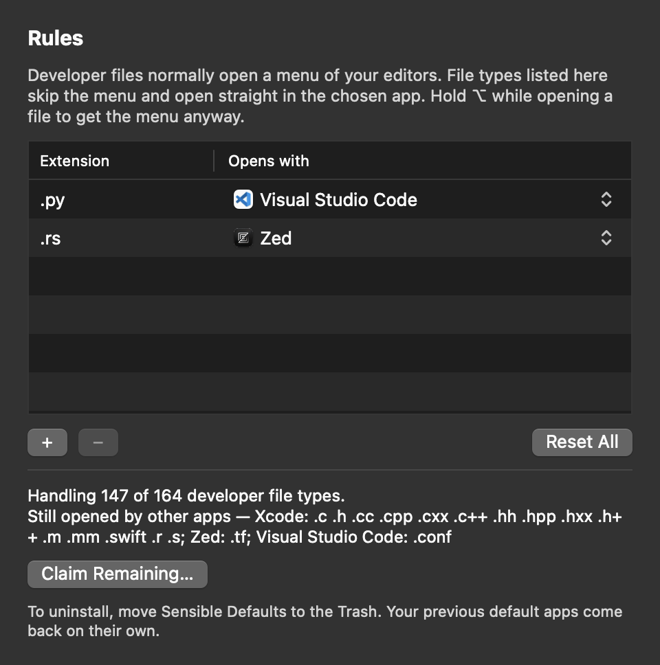

# Sensible Defaults

Double-click a source file on macOS and it opens in Xcode, or IDLE, or a browser, or a terminal.
Sensible Defaults replaces that with a small menu of the editors you have installed. There is nothing to configure.



## What it does

- Opening a developer file (`.py`, `.json`, `.rs`, `.md`, … 165 extensions) shows a menu at the cursor: VS Code, Zed, Xcode and whatever else is installed, most recently used first. Press `1`–`9` or click.
- **Always Open .ext With** in that menu remembers a choice, so that file type skips the menu from then on. Hold ⌥ while opening to get the menu anyway.
- **Edit Rules…** (or launching the app directly) opens a small window to change or remove those choices.
- `.ts` files that are really MPEG video go to your video player; TypeScript gets the menu.
- HTML, SVG, plain text, CSV, logs, property lists and Xcode's own formats are left alone, and so is anything you assigned yourself in Finder's Get Info.

## Install

Build from source (needs the Xcode command line tools):

```bash
git clone https://github.com/rupert-br/sensible-defaults && cd sensible-defaults
scripts/build-app.sh --install
```

This puts `Sensible Defaults.app` in `/Applications` and registers it.

Or with Homebrew, which installs the notarized release into `/Applications`:

```bash
brew tap rupert-br/sensible-defaults https://github.com/rupert-br/sensible-defaults
brew install --cask rupert-br/sensible-defaults/sensible-defaults
```

Then open Sensible Defaults once to activate it.

To uninstall, move the app to the Trash. Your previous default apps come back on their own.

## How it works

Since macOS 26.4, changing a file type's default app from a script shows a confirmation dialog per type, which rules out the usual `duti` loop. Sensible Defaults does not change any defaults. It declares the developer file types in its `Info.plist` with `LSHandlerRank` `Owner`, which outranks the claims of Xcode, browsers and editors, so Launch Services picks it on its own. When a file arrives it shows the menu, hands the file to the app you pick and quits.

A few types are not won this way; on a Mac with Xcode installed, Xcode keeps C, C++, Objective-C, Swift, assembly and Rez sources. The rules window lists them and offers **Claim Remaining…**, which asks macOS for each one (one confirmation dialog per type).

Files without an extension (`Makefile`, `Dockerfile`, `LICENSE`) are not covered: macOS types them as generic data, and claiming that would hijack every unknown file.

## Development

```bash
swift test                    # unit tests for the decision logic
scripts/build-app.sh          # build/Sensible Defaults.app, ad-hoc signed
scripts/handlers.sh --summary # which app currently opens each claimed extension
```

- `Support/extensions.txt` and `Support/Info.plist` list the claimed extensions; a test keeps them in sync. Add new ones to both.
- `Support/editors.json` is the catalogue of known editors.
- `Sources/SensibleCore` holds the platform-neutral logic, `Sources/SensibleDefaults` the AppKit app.
- Logs: `/usr/bin/log show --last 5m --info --predicate 'subsystem == "io.github.rupert-br.sensible-defaults"'`

macOS only. A Linux port would be straightforward (`.desktop` file plus `xdg-mime`); Windows blocks programmatic default changes.

## License

MIT
